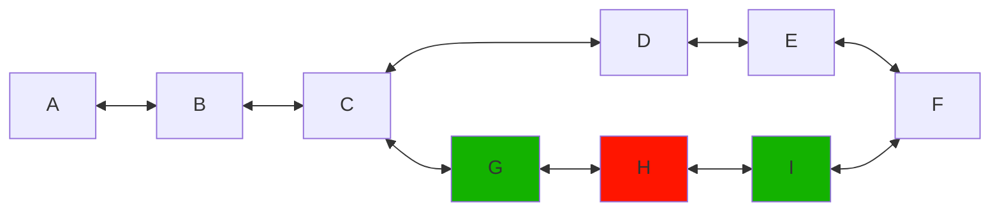
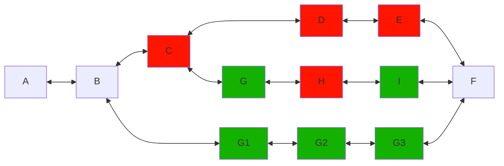

# Task 1 - BUDA Postulation

## Problem
>Escribe un programa que permita calcular la ruta con menor cantidad de estaciones entre
dos estaciones de una red de metro. En la red de metro algunas estaciones pueden tener
un color asociado (Rojo o Verde) que indica que un tren exprés de color Verde pasará solo
por estaciones sin color o Verde, y un tren exprés de color Rojo pasará solo por estaciones
sin color o Roja (see `./Tarea_Buda.com_-_Metro.pdf)`

It's important to note that when a train is express, it can stop only stations with no color or to it's own color. But can still use the rails with other colors. 

For example, we use the given example to show this:

The green train can still pass through the `H` Station but without stopping. So, according to the example, one of the shortest path between `A & F` for a green train, would be `A -> B -> C -> G -> I -> F`

So, if we have the following stations:

The shortest path for a red train between `A & F` would be `A -> B -> F`

-----------------


## Solution
For the solution to this problem I'm going to use `Dijkstra` algorithm using the module `networkx` that supports better implementations for *graphs* and as a built in method for calculating the shortest path between two nodes. 

The main problem now would be how to avoid counting the wrong stations when it's a express train or not. For these, I'm going to difine an edge's weight as the count of stations to pass trough when taking an edge and set the weights to 0. So, when a train is traveling towards a station with a different color, the algorithm will ignore the cost of that edge, in other words, ignoring the count for that station.

### File describing the train network
Below is an example of the desing used for the input network file. It's to be a `.json` file. <br>
The file consists in 3 main parts: 
- *nodes*: First level keys, represents the node. Example: `"A", "B", 1, 2, etc`;
- *color*: Represents the colors of the node. If it has a color, only `normal` trains (`color=None`) or trains with the same color can stop in that station (node). Also, a station (node) can have multiple colors. Example: `["green"]`, `["blue", "red", etc`. If it has no color, then all trains can stop in that station (node). 
- *costs*: Represents the edges of the graph, and is a list of tuples, each containing two values: `[<way to another node>, <amount of stations passing by>]`. The second value should be always be 1.
```json
{
    "A": {
        "color": [],
        "costs": [
            ["B",1]
        ]
    },
    "B": {
        "color": ["red"],
        "costs": [
            ["A", 1], ["C", 1]
        ]
    },
    "C": {
        "color": [],
        "costs": [
            ["B", 1]
        ]
    }
}

```
The previous json setting would be the following:

Remember, when a station has a color, then only trains with the same color or normal trains (null color) can stop in that station.

### Solution modeling
Will use Python 3.8.10, but any version of Python > 3.8 should work

## Initialization (Unix)

### Virtual environment:
+ Create virtual environment (For development was used Python3.8.10)
```bash
python3 -m venv venv
```

+ Activate virtual environment
```bash
source venv/bin/activate
```

+ Install dependencies
```bash
pip3 install -r requirements.txt
```

## How to Run
The main file is `caculate_shortest_path.py` and is has the following run flags:
+ `-j, --graph_json_path`: Path to the json file describing the train network.
+ `-r, --root`: Root node of the graph.
+ `-g, --goal`: Goal node of the graph.
+ `-c, --color`: Color of the train.

+ Run tests
```bash
python3 -m unittest
```

+ Run main file
```bash
python3 calculate_shortest_path.py -j ./network_graph.json -r A -g F -c red
```

